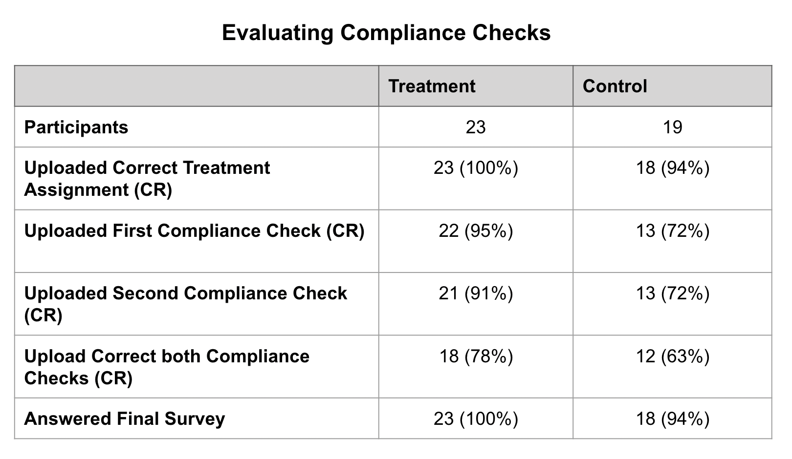

layout: true

<div class="my-footer"><span>CSMaP Lab Meeting, 09-01-2022</span></div> 

```{r setup, include=FALSE}
options(htmltools.dir.version = FALSE)
knitr::opts_chunk$set(messagwese=FALSE, warning = FALSE)
xaringanthemer::style_mono_light(base_color ="#23395b", 
                                  title_slide_text_color="#23395b", 
                                  title_slide_background_color = "#fff", 
                                  background_color = "#fff", 
                                  link_color =  "#23395b")
options(htmltools.dir.version = FALSE)
knitr::opts_chunk$set(message=FALSE, warning = FALSE, error=TRUE, echo=FALSE, cache=TRUE)
```

```{r style-share-again, echo=FALSE}
xaringanExtra::use_tile_view()
xaringanExtra::use_panelset()

#xaringanExtra::style_share_again(
#  share_buttons = c("twitter", "linkedin", "pocket")
#)
```

---
class:middle

## WhatsApp 101

--

.panelset.sideways[

.panel[.panel-name[WhatsApp]

.darkblue[**WhatsApp is an end-to-end encrypted messaging app**]

- Close to 2 billion active users.

- Same number of active users of YT. Only behind Facebook. 

- Allows for both direct and group communication.

- Allows for audio and video calls, as well as sharing of media content. 
 
]

.panel[.panel-name[Usage in Brazil]

- .red[66% of the Brazilian eligible voters] has a social media account, and .red[65% have an WhatsApp account] ([Datafolha 2018](http://media.folha.uol.com.br/datafolha/2018/10/27/44cc2204230d2fd45e18b039ee8c07a6.pdf)) – 150 million people in 2022. 


- It is the most used app for all purposes: .red[talk to family & friends, do business & pay bills, consume news, talk politics, among others] ([Reuters Institute, 2021](https://reutersinstitute.politics.ox.ac.uk/digital-news-report/2021)). 


- It is used by .red[48% of population to read news], despite having no “news feed” ([Reuters Institute, 2021](https://reutersinstitute.politics.ox.ac.uk/digital-news-report/2021))


]
]

---
## Motivation

.center[
```{r out.width="100%"}
knitr::include_graphics("nyt.png")
```
]

.footnote[Source: [here](https://www.nytimes.com/2018/10/19/technology/whatsapp-brazil-presidential-election.html) and [here](https://www.nytimes.com/2018/10/17/opinion/brazil-election-fake-news-whatsapp.html)]

---
class: middle

### Literature


- No research so far on the causal effects of WhatsApp on users' likelihood to fall for misinformation and other political attitudes. 

--

- .red[Asimovic et. al. 2021 and Alcott et. al. 2020] use deactivation experiments on Facebook as an strategy to identify causal effects of social media usage.
--

- WhatsApp deactivation is considerably more challenging.

  - WhatsApp is the most used app for all purposes in Brazil.
  - No easy way back to the app.
  - Little policy implication.

--

---
class:middle

###  Intervention 

`r icons::fontawesome("arrow-alt-circle-right")` **Our Solution:** .red[WhatsApp Media Deactivation].

--
- Media (videos and images) represent the main channel through which misinformation and polarizing content spreads on WhatsApp .red[(Resende et al. 2019; Freitas Melo et al. 2019, Garimella and Tyson, 2018, Garimella and Eckles, 2020, Machado et al. 2019)].

- Reduce exposure to media received on WhatsApp, and cut exposure to misinformation and polarizing content ahead of the election in Brazil. 


--


`r icons::fontawesome("arrow-alt-circle-right")` **Experiment:** Offers respondents a monetary incentive to:

- Disable their automatic download of media on WhatsApp.
- Do not watch any media on WhatsApp.

--

`r icons::fontawesome("arrow-alt-circle-right")` **Treatment Period:** Three weeks:

- **Start:** Two weeks the before presidential elections in Brazil.
- **End:** One week after the voting day.


---
## Overview of the Experiment

.panelset.sideways[

.panel[.panel-name[Design]
```{r, echo=FALSE}
library(DiagrammeR)
survey_flow <- mermaid(diagram="
graph TD
A[Recruitment Survey: <br/> Facebook Ads]--> |Participant Selection| Comp[Start the Experiment: <br/> Upload image disabling downloads]
Comp --> Tall{Randomization}
Tall --> |Treatment| Tb[3 weeks without media]
Tall --> |Control| C[3 days no media & <br/> Use Whatsapp as usual]

C --> G[Compliance Checks]
Tb --> G
G --> Final{Final survey}

style Tall stroke:#333,stroke-width:2px,fill:#FFFF00
style Final stroke:#333,stroke-width:2px,fill:#FFFF00
             ",
width="100%")
survey_flow
```
]

.panel[.panel-name[Filtering Questions]

- Time spent on WhatsApp > 10 minutes every day

- Should not use desktop WhatsApp

- Accept to join the study

- `r icons::fontawesome("question")` .red[Received images about politics on WhatsApp] `r icons::fontawesome("question")`


]

.panel[.panel-name[Treatment Groups]

`r icons::fontawesome("arrow-alt-circle-right")` **Treatment**

- 3 weeks with automatic download disabled

- 3 weeks without consuming media

- Weakly screenshots of storage of media consumption on WhatsApp

`r icons::fontawesome("arrow-alt-circle-right")` **Control**

- 3 days with automatic download disabled

- 3 days without consuming media

- Weakly screenshots of storage of media consumption on WhatsApp

]

.panel[.panel-name[Timeline]

- **Start Recruitment:** Between September 2th - 5th

- **Start the Experiment** September 15th

- **Activation of the Control + First Compliance**: September 18th

- **Treatment duration**: From September 15th to October 6th

- **Presidential Election**: October 2


]
]

---
## Measuring Compliance I

.center[
#### Automatic Download


```{r out.width="20%"}

```
]

---
### Measuring Compliance II: Media Consumption

.center[

#### Storage Information

```{r out.width="20%"}

```

]

--


---
class:middle

## Outcomes

--
#### .darkblue[Misinformation] 

- False Headlines published by fact-checking webpages during the month of the experiment + True headlines from mainstream media.

--

#### .darkblue[Polarization]

- Affective polarization (Feeling Thermometer)
- Social Polarization (i.e. Watching the world cup with an outgroup)
- False Polarization ('Where do I observe the two main candidates?')
- .red[Issue Polarization?]

--

#### .darkblue[Subjective Well-being]

- How did you feel last week? (Happy, Anxious, etc...)

--


---
class:middle
## Hypotheses

--

- H1a: Users using the Media-Constrained WhatsApp will display a .red[higher ability to accurately identify FALSE headlines] compared to their counterparts using the regular WhatsApp.

- H1b: Users using the Media-Constrained WhatsApp will display .red[lower ability to to accurately identify TRUE headlines from  mainstream news] compared to their counterparts  using the regular WhatsApp.

--

- H2: Users using the Media-Constrained WhatsApp  will display .red[lower levels of outgroup partisan polarization] compared to their counterparts using the regular WhatsApp.

--

- H3: Users using the Media-Constrained WhatsApp will display .red[higher levels of the aggregated index of subjective well-being] compared to their counterparts using the regular WhatsApp.

--


---
class: middle, center, inverse

## One-Week Pilot Study

---
class:middle, 
## Summary


**Recruitment**: Facebook Ads

**Experimental Condition:**

- **Treatment** Full-week of no media
- **Control**: Three days with no media.

**Experiment Assignment:** After uploading proof of disabling automatic download of media.

**Responses:**
  - 540 complete responses for the screening
  - 317 passed  the filters 
  - 74 invited to join the experiment (August 19-20)

---
## Attrition Rate

.panelset.sideways[

.panel[.panel-name[Results]

.center[
```{r out.width="100%"}

```
]
]

.panel[.panel-name[Notes]

We recruited 540 completes in the screening, from which 317 passed all the screening questions. 

To invite participants, we block randomized on gender, education and age to select 74 out of 317. This probably give us a lower bound for the attrition rate.

In addition, we started with email communication, and moved later to direct WhatsApp messages. The later is way more effective.  

]
]

---
## Evaluating Compliance Checks

.center[
```{r out.width="100%"}

```
]

---
### Changes in Media Consumption

.center[
```{r out.width="100%"}

```
]

---
## Comparing Demographics

.center[
```{r out.width="100%"}

```
]
---
## Open Questions

#### Mechanisms for misinformation

- Working with exposure (Have you seen this headline before?).  What else is important to be included in the survey?

#### Headlines selection
- Any advice on how to select the headlines? .red[Should we take advantage of the compliance survey and  add some headline tasks while collecting screenshots for compliance?]

#### Compliance: .black[What can we do better?]
 
#### Descriptive information: .black[Which data should we collect?] 

---
class:inverse, middle, center

## What else? 

### Thanks!

---
## Power Analysis

.panelset.sideways[

.panel[.panel-name[Effect Size in SD]


### Alcott et. al.

- **Polarization index:** -0.16 
- **News Knowledge index:** -0.19 
- **Subjective well-being index:** 0.09 

### Asimovic et. al.

- **Outgroup Regard index:** -0.24
- **News Knowledge index:** -0.27
- **Subjective well-being index:** 0.18


]


.panel[.panel-name[Power Analysis]

.center[
```{r out.width="100%"}

```
]
]
]

